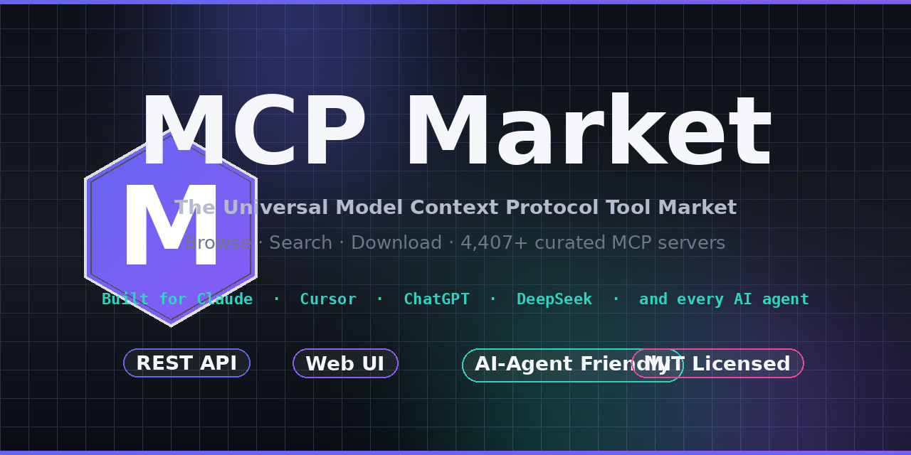

# MCP Hub

> **The Universal MCP Tool Market** — 4,400+ curated Model Context Protocol servers, REST API, web UI, and AI-agent friendly discovery for Claude, Cursor, ChatGPT, and every AI agent.

<p align="center">
  <a href="https://github.com/badhope/MCP-HUB/blob/main/LICENSE"></a>
  <a href="https://github.com/badhope/MCP-HUB/actions"></a>
  <a href="https://github.com/badhope/MCP-HUB/releases"></a>
  <a href="https://github.com/badhope/MCP-HUB/stargazers"></a>
  <a href="https://github.com/badhope/MCP-HUB/issues"></a>
  <a href="https://github.com/badhope/MCP-HUB/blob/main/README_CN.md"></a>
</p>

<p align="center">
  
</p>

---

## What is MCP Hub?

**MCP Hub** is a free, open-source, community-driven **marketplace of MCP (Model Context Protocol) servers**. It is built for three audiences:

1. **AI application users** — browse and download ready-to-use MCP configurations for Claude Desktop, Cursor, ChatGPT, and other MCP-compatible clients.
2. **AI agents** — a stable, queryable REST API and a downloadable offline index of all servers, so your agent can recommend the right tool on demand.
3. **MCP server authors** — submit your server once and reach the entire MCP ecosystem.

| What you get | Count |
|---|---|
| Indexed MCP servers | **4,400+** |
| Curated official servers | **51** |
| Categories | **23** |
| REST API endpoints | **35+** |
| Daily upstream sync | ✅ |
| Generated configs (Claude, Cursor, …) | ✅ |
| AI-agent discoverability | ✅ |

> Data syncs daily from the upstream [awesome-mcp](https://github.com/Rodert/awesome-mcp) registry. The index is rebuilt and republished on every CI run.

---

## ✨ Features

- 🔍 **Powerful discovery** — full-text search, category / language / quality / stars filters, sort by stars or last-updated
- 🎨 **Modern web UI** — React + TypeScript + Tailwind, dark mode, mobile responsive, one-click config generator
- ⚡ **FastAPI backend** — async, type-safe (Pydantic v2), auto Swagger / ReDoc at `/docs` and `/redoc`
- 🤖 **AI-agent first** — every endpoint is also a stable JSON contract; ships a downloadable offline index
- 📤 **Config generation** — ready-to-paste configs for Claude Desktop, Cursor, and any stdio-based MCP client
- ⭐ **Quality scoring** — automatic completeness, health, and quality scoring per server
- 🔄 **Daily auto-sync** — GitHub Actions workflow re-indexes the upstream registry and commits the result
- 🐳 **One-command deploy** — `docker compose up` brings up the full stack
- 🛡️ **Security** — automated secret scanning, branch protection, signed releases, no telemetry

---

## 🚀 Quick start

### Option 1 — Docker Compose (recommended)

```bash
git clone https://github.com/badhope/MCP-HUB.git
cd MCP-HUB

# Build the server index (one-time, ~5 MB download)
python tools/sync_index.py

# Start the full stack
docker compose up -d --build

# Web UI  : http://localhost:5173
# REST API: http://localhost:8080
# API docs: http://localhost:8080/docs
```

### Option 2 — Local Python (no Docker)

```bash
git clone https://github.com/badhope/MCP-HUB.git
cd MCP-HUB

pip install -r requirements.txt
python tools/sync_index.py            # populate servers-index.json
python main.py                        # API on :8080
```

In another terminal, the web UI:

```bash
cd frontend
npm install
npm run dev                           # UI on :5173, talks to the API above
```

### Option 3 — REST API only (any language)

```bash
# Health
curl http://localhost:8080/

# Search
curl "http://localhost:8080/servers?search=github&limit=5"

# Browse by category
curl "http://localhost:8080/servers/by-category/development?limit=5"

# Generate a Claude Desktop config
curl http://localhost:8080/config/github-mcp-server
```

The full endpoint list is at **[`/docs`](http://localhost:8080/docs)** (Swagger UI) and **[`/redoc`](http://localhost:8080/docs)** (ReDoc) once the server is running.

---

## 📡 REST API at a glance

| Group | Endpoints |
|---|---|
| Health & stats | `GET /`, `GET /stats`, `GET /stats/all` |
| Discovery | `GET /servers`, `GET /servers/{name}`, `GET /servers/popular`, `GET /servers/recent`, `GET /servers/curated`, `GET /servers/by-category/{category}`, `GET /servers/by-quality` |
| Configuration | `GET /config/{name}`, `GET /export/markdown/{name}`, `POST /export/batch-json`, `POST /export/batch-markdown` |
| Recommendations | `GET /recommend/for-use-case`, `GET /recommend/similar`, `GET /compare` |
| Validation | `GET /validate/server/{name}`, `GET /validate/all`, `GET /validate/health`, `GET /validate/low-quality` |
| User | `POST/GET /favorites/*`, `POST/GET /ratings/*`, `POST/GET /comments/*` |
| Submissions | `POST /submissions/submit`, `GET /submissions`, `POST /submissions/review` |

`GET /servers` supports: `search`, `category`, `language`, `sort` (`stars` / `updated`), `min_stars`, `limit`, `offset`.

See **[`docs/API.md`](docs/API.md)** for the full reference.

---

## 🤖 For AI agents

MCP Hub is **indexed for agent consumption**:

- The **REST API** returns pure JSON, no scraping needed.
- A static **`servers-index.json`** ships with every release for offline use.
- OpenAPI schema at **`/openapi.json`** is consumable by any OpenAPI-aware agent.

```python
import requests

# Discover
servers = requests.get("https://mcp-hub.example.com/servers", params={"search": "github"}).json()

# Generate a config
config = requests.get("https://mcp-hub.example.com/config/github-mcp-server").json()
```

Point your agent's tool-search step at the live API and stop maintaining your own server list.

---

## 🏗️ Architecture

```
┌──────────────────┐    HTTP/JSON    ┌──────────────────┐
│   React + Vite   │ ──────────────► │  FastAPI backend │
│   Web UI (:5173) │                 │     (:8080)      │
└──────────────────┘                 └──────────────────┘
                                              │
                                              ▼
                                     ┌──────────────────┐
                                     │ servers-index    │
                                     │   .json (4,400+) │
                                     └──────────────────┘
                                              ▲
                                              │ daily
                                     ┌──────────────────┐
                                     │ GitHub Actions   │
                                     │  tools/sync_…    │
                                     └──────────────────┘
```

- **Backend** — single-process FastAPI app (`main.py`), Pydantic v2 models, async route handlers, lifespan-managed index cache
- **Frontend** — Vite + React 18 + TypeScript + TanStack Query + Zustand, lazy-loaded routes, dark mode
- **Index** — static JSON rebuilt daily from upstream [awesome-mcp](https://github.com/Rodert/awesome-mcp)
- **CI/CD** — GitHub Actions: secret scan → backend tests → frontend build → publish release

---

## 📚 Documentation

| Doc | Purpose | Language |
|---|---|---|
| [README.md](README.md) | This file — overview, features, quick start | 🇬🇧 English |
| [README_CN.md](README_CN.md) | 中文文档 · 总览、特性、快速上手 | 🇨🇳 中文 |
| [docs/USER_GUIDE.md](docs/USER_GUIDE.md) | **Complete user guide** — 5 real workflows (install / discover / agent-consume / submit / self-host), CLI tools, troubleshooting, FAQ | 🇬🇧 English |
| [docs/USER_GUIDE_CN.md](docs/USER_GUIDE_CN.md) | **完整用户指南** — 5 个真实使用场景（安装 / 检索 / Agent 接入 / 提交 / 私有化）、CLI 工具、故障排查、FAQ | 🇨🇳 中文 |
| [docs/QUICKSTART.md](docs/QUICKSTART.md) | 5-minute local setup | 🇬🇧 English |
| [docs/QUICKSTART_CN.md](docs/QUICKSTART_CN.md) | 5 分钟本地启动 | 🇨🇳 中文 |
| [docs/API.md](docs/API.md) | Full REST API reference (auto-generated from OpenAPI) | 🇬🇧 English |
| [CONTRIBUTING.md](CONTRIBUTING.md) | How to contribute (dev workflow, coding standards, PR checklist) | 🇨🇳 中文 |
| [CODE_OF_CONDUCT.md](CODE_OF_CONDUCT.md) | Community standards | 🇬🇧 English |
| [CODE_OF_CONDUCT_CN.md](CODE_OF_CONDUCT_CN.md) | 社区行为准则 | 🇨🇳 中文 |
| [SECURITY.md](SECURITY.md) | Security policy & threat model | 🇬🇧 English |
| [SECURITY_CN.md](SECURITY_CN.md) | 安全与隐私策略 | 🇨🇳 中文 |
| [SUPPORT.md](SUPPORT.md) | Where to get help | 🇬🇧 English |
| [SUPPORT_CN.md](SUPPORT_CN.md) | 寻求帮助 | 🇨🇳 中文 |
| [CHANGELOG.md](CHANGELOG.md) | Release history | 🇬🇧 English |
| [AGENTS.md](AGENTS.md) | Conventions for AI coding agents | 🇬🇧 English |

---

## 🤝 Contributing

We welcome issues and pull requests. The fastest ways to help:

- 🐛 **Report a bug** — use the [bug report template](.github/ISSUE_TEMPLATE/bug_report.md)
- 💡 **Request a feature** — use the [feature request template](.github/ISSUE_TEMPLATE/feature_request.md)
- 🆕 **Submit a server** — use the [server submission template](.github/ISSUE_TEMPLATE/server_submission.md) **or** call `POST /submissions/submit`
- ❓ **Ask a question** — use the [Q&A template](.github/ISSUE_TEMPLATE/question.md)
- 🔒 **Report a security issue** — see [SECURITY.md](SECURITY.md), **do not** open a public issue

See [CONTRIBUTING.md](CONTRIBUTING.md) for the dev workflow, coding standards, and PR checklist.

---

## 📄 License

[MIT](LICENSE) © MCP Hub contributors.

---

## 🙏 Acknowledgments

- [awesome-mcp](https://github.com/Rodert/awesome-mcp) — the upstream registry that powers the daily index sync
- [Model Context Protocol](https://modelcontextprotocol.io) — the standard that makes it all possible
- Every MCP server author and contributor — this market is nothing without your work

---

<p align="center">
  <sub>Built with care for the MCP community. <a href="https://github.com/badhope/MCP-HUB/discussions">Join the discussion →</a></sub>
</p>
